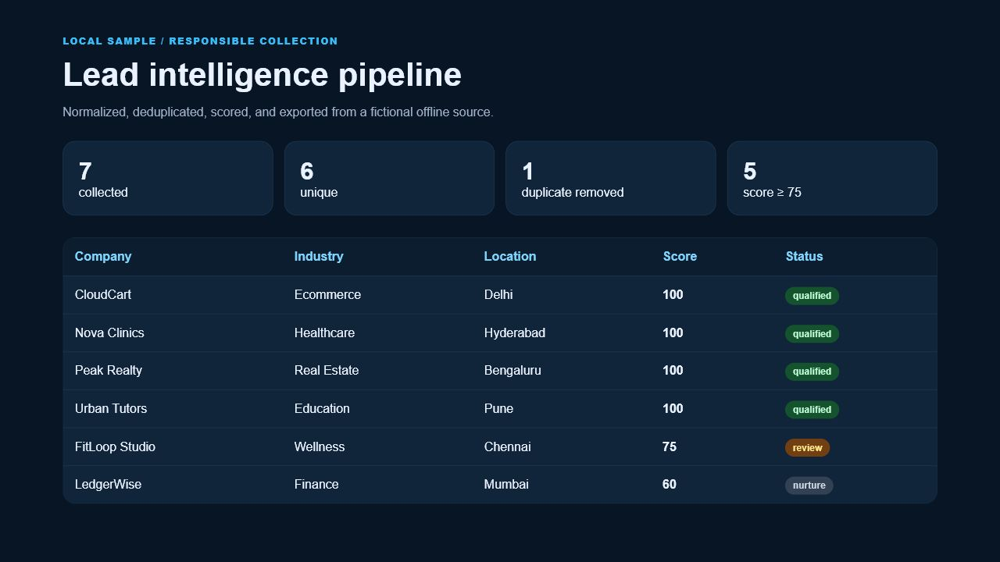

# Lead Intelligence Pipeline

[](https://github.com/rongali-commits/lead-intelligence-pipeline/actions/workflows/ci.yml)
[Portfolio](https://www.rongalichaitanya.com) · [Discuss a data workflow](mailto:hello@rongalichaitanya.com)

A responsible, offline-first Python workflow for collecting structured business records, normalizing fields, removing duplicates, scoring completeness, and exporting sales-ready CSV files.



## Business problem

Teams often copy public business information into spreadsheets, then lose time fixing inconsistent names, duplicate domains, missing fields, and low-quality records. This project demonstrates the data-quality layer that should sit between collection and outreach:

```text
approved source -> collect -> normalize -> deduplicate -> score -> review/export
```

## Demonstrated outcome

Running the included fictional HTML directory produces:

| Measure | Sample run |
| --- | ---: |
| Source records collected | 7 |
| Unique records retained | 6 |
| Duplicates removed | 1 |
| Records scoring at least 75 | 5 |

These are reproducible sample-run measurements, not client acquisition claims.

## Features

- local HTML source adapter with no network requests;
- normalized whitespace, URLs, emails, and fields;
- domain-first deduplication with best-record retention;
- transparent 100-point completeness score;
- separate all-leads and qualified-leads CSV exports;
- JSON run summary and generated HTML dashboard;
- tests for deduplication, qualification, and invalid configuration.

## Quick start

Requires Python 3.11 or newer.

```bash
python -m venv .venv
# Windows: .venv\Scripts\activate
# macOS/Linux: source .venv/bin/activate
python -m pip install -e ".[dev]"
lead-pipeline sample_data/directory.html --output output --minimum-score 75
pytest
```

Open `output/dashboard.html` and inspect `output/qualified_leads.csv`.

## Scoring model

| Field | Points |
| --- | ---: |
| Website | 40 |
| Valid email | 25 |
| Industry | 15 |
| Location | 10 |
| Useful description | 10 |

The score measures record completeness, not purchase intent. A human should approve any outreach criteria.

## Repository structure

```text
src/lead_intelligence/  collection, normalization, scoring, export, and CLI
sample_data/            fictional `.example` records only
tests/                  deterministic pipeline tests
docs/                   verified screenshot
```

## Responsible-use boundaries

This repository makes no live web requests. A production source adapter should be added only for sources whose terms permit automation, with `robots.txt` checks, explicit rate limits, an identifiable user agent, data minimization, suppression lists, and applicable privacy-law review. The included companies, domains, and contacts are fictional; `.example` is a reserved domain namespace.

## License

MIT — see [LICENSE](LICENSE).
